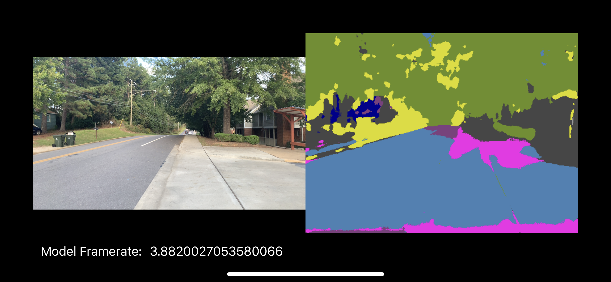
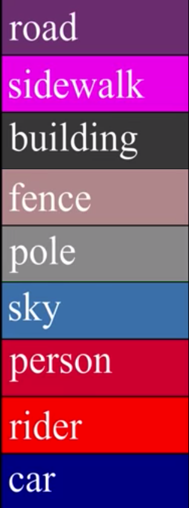

# iOS Semantic Segmentation

An example of semantic segmentation on iOS using CoreML and Keras. Trained
Tiramisu 45 weights come from [here][sem-seg]. A device with a camera is
required, preferably a newer one to maintain an acceptable frame-rate from
the model.

[sem-seg]: https://github.com/Kautenja/neural-semantic-segmentation

<strong>Predictions from Tiramisu 45 on iPhone XS Video Stream.</strong>
<table>
    <tr>
        <td>
            
        </td>
        <td>
            
        </td>
    </tr>
</table>

-   note that the 1280 × 720 input image is scaled (fill) to 480 × 352,
    explaining the discrepancy in size between the camera stream and
    segmentation outputs

## Requirements

-   iOS >= 12.x
    -   The Metal Performance Shader for ArgMax feature channel reduction is
        only available from iOS 12 onward. An iterative CPU implementation of
        ArgMax results in a _3x_ slowdown compared to the vectorized GPU one
        on Metal (on iPhone XS).

## Model

The original Keras model file can be found in [Tiramisu/Models][models] as
[Tiramisu45.h5][model-h5]. An accompanying python file, [convert.py][convert],
handles the conversion from the Keras model into a CoreML model as
[Tiramisu45.mlmodel][model-mlmodel] using [coremltools][coremltools]. The
model is trained first on CamVid, then on CityScapes using similar
hyperparameters as reported in the original paper. Additional augmentation
is performed (brightness adjustment, random rotations) during training to
promote a model that is robust against variations in lighting and angle
from the camera.

[models]: ./Tiramisu/Models
[convert]: ./Tiramisu/Models/convert.py
[model-h5]: ./Tiramisu/Models/Tiramisu45.h5
[model-mlmodel]: ./Tiramisu/Models/Tiramisu45.mlmodel
[coremltools]: https://github.com/apple/coremltools

## Frame Rate

Tiramisu 45 is heavy weight despite few (≈800,000) parameters due to the
skip connections in dense blocks and between the encoder and decoder. As a
result, the frame-rate suffers. The values reported here are averaged over
30 seconds of runtime after application initialization. Note that because of
intense computation, the devices will get hot quickly and begin thermal
throttling. The iPhone XS frame-rate drops to ≈6 when this throttling occurs.

| Device    | Frame Rate |
|:----------|:-----------|
| iPhone XS | ≈ 12       |
| iPhone 7  | ≈ 2        |
| iPad Air  | < 1        |
